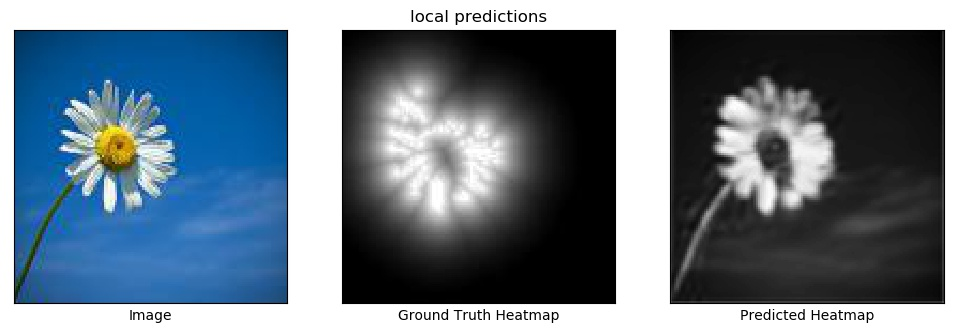

# tf-keras-gcloud-deployment
Training and deploying a tf.keras model using Google Cloud ML Engine

## Introduction

While trying to deploy a tf.keras model using Google Cloud Platform (GCP) ML Engine, I ran into many challenges and found the documentation lacking in many ways. Once I finally got things working, I decided to put it all together in this repo to potentially help others who are doing the same thing. This codebase focuses on the cloud deployment side of things. All of the model training is done locally, but there are many tutorials for how to train on the cloud as well. The deployment scenario also mainly deals with image inputs, though handles them in different ways (including a simple list string, a base64 encoding, and GCP Storage link).

What is shown here is just one way to get this whole process working. The specific configurations may not be optimal for everyone's use case. Additionally, this field moves very quickly and the APIs are often changing so what works now may not work in 6 months.


## Setup

This code is tested in python 3.6 on Mac OSX 10.13 with an Anaconda distribution (though all dependencies are reinstalled). The python libraries required are all installed within a virtual environment. If you don't have virtualenv, install it before proceeding. In the project root directory, run the following:

```bash
virtualenv env
source env/bin/activate
pip install -r requirements.txt
```


### Setting up TensorFlow

In this codebase we are using TensorFlow version 1.10 without a GPU. We will install it directly using the following command:

```bash
pip install --upgrade https://storage.googleapis.com/tensorflow/mac/cpu/tensorflow-1.10.1-py3-none-any.whl
```

If not on Mac, follow the TensorFlow installation instructions [here](https://www.tensorflow.org/install/pip).


## Model Training and Preparation

In this example, we are training a very simple fully convolutional model on a toy dataset. The output heatmaps capture the brightest parts of the image. This problem is not very interesting, but it will allow us to train a model quickly and use it for deployment. The multidimensional nature of the output makes the deployment a bit more interesting, but all the steps below should be the same for a flat output such as what you'd have with a simple classification model.

### Model Training

In the root directory of the repo, run:

```bash
python train.py
```


### Exporting the Model

Here we need to convert our tf.keras .h5 model so the SavedModel format that is compatible with GCP deployment. There are quite a few complexities in setting everything up to correctly work. The biggest challenge is getting the input data handled correctly for the desired format. This StackOverflow [post](https://stackoverflow.com/questions/51432589/how-do-i-get-a-tensorflow-keras-model-that-takes-images-as-input-to-serve-predic) was particularly helpful in getting everything right.

In this code, we will export three different models that are set up to handle data in different formats. When calling "gcloud ml-engine predict", the input is always a JSON file, but the contents within the JSON file vary depending on the desired input type. The following formats are supported:
1. Image converted to a list and written as a string in the JSON file
    - This is the simplest approach, but the least efficient and for larger images, the JSON file exceeds the filesize limit
2. JPEG image bytes written to a string using a base64 encoding
    - More complex, but smaller JSON file size
3. Image is just a URL in the JSON file (generally pointing to an image file stored in some bucket in GCP Storage)

Run the following code to export the three different models. They'll end up in the "models" folder.

```bash
python export_models.py
```

NOTE: The base64 and url methods assume that the images are always jpeg. The code will need to be adapted to work with other image types. Just switching to decode\_image instead of decode\_jpeg does not solve the problem because decode\_image has variable output shape because of the GIF format.

NOTE: This section doesn't do much to optimize the size of the model. There are other actions that can be taken in the export process to optimize the model for inference. This [tutorial](https://cloud.google.com/ml-engine/docs/tensorflow/deploying-models) has some helpful information.


## General GCP Configuration

To start off, you will need to have a GCP account. If this is your first time creating a GCP account, you may get some free credits. Once you have an account, follow the instructions below to get everything set up for this demo.

Follow steps 1-6 in the "Set up your GCP project" [here](https://cloud.google.com/ml-engine/docs/tensorflow/getting-started-training-prediction#set-up-your-gcp-project).
- In step 1, first select your organization, then click on "CREATE PROJECT", name the project "tf-keras-deploy"
- Step 2 might not be necessary as billing may be set up by default for the project
- In step 3, go to the linked page and select the "tf-keras-deploy" in the lower dropdown and click "Continue"
    - This takes a couple of minutes to process
    - Eventually the page will reload with a "Go to credentials" link
- Follow the exact directions in step 4
    - Find the downloaded JSON file and move it into ~/.gcloud (make this directory first)
- Steps 5 and 6 are pretty straightforward


## GCP Bucket Setup

To deploy a model to GCP, you need to have a storage bucket on GCP where the model resides. We will also use this bucket for sample data for the deployment option that just passes the URL when calling predict. Below are a quick set of instructions for setting up a bucket from the console. See the first 4 steps in this [tutorial](https://cloud.google.com/ml-engine/docs/tensorflow/getting-started-training-prediction#set_up_your_storage_name_short_bucket) for more details.

NOTE: if you already had the Google cloud SDK installed on your machine, you will probably need to set the active project to the one we created in the above steps. You can do this with the following terminal command:

```
gcloud config set project tf-keras-deploy
```

Be sure that the last parameter above is the project_id, not the project name. In some cases, they may be different from each other (for example if you delete a project and then create a new one with the same name, the id will not match the name).

To create a new bucket run the following commands in the terminal:

```
PROJECT_ID=$(gcloud config list project --format "value(core.project)")
BUCKET_NAME=${PROJECT_ID}-mlengine
echo $BUCKET_NAME
REGION=us-central1
gsutil mb -l $REGION gs://$BUCKET_NAME
```


## Input Preparation

Before moving on to testing, we will prepare some JSON input files that have the correct data format. Some of the docs suggest a JSON input format that looks something like this:

```
{
  "instances": [
    {"input_key": image_content},
    {"input_key": image_content}       
  ]
}
```

This may be necessary for processing a set of images. For single image processing, we found that it was necessary to use the following simpler format:

```
{"input_key": image_content}
```

In both examples above, the "input\_key" should be consistent with the input key used in [export_models.py](export_models.py). For base64 encodings, this key must end with the string "bytes". The image content will differ depending on the input type being used. For the image as list string, this content is just a big string with the list. For the URL input version, the image_content is just a string with the URL. For the base64 encoded input, the image content is actually another dictionary that looks like this:

```
{"b64": base64_encoded_string}
```

To generate these sample input JSON files for a test image in "data/test", run the following script:

```bash
python image_to_json.py
```

Note that the base64 encoded JSON file is about 60 times smaller than the file with the image values written out as a list string. This is the main motivation for using the base64 encoding.


## Model Deployment and Testing

In this example, we will create a single model and then use different versions of the model to test the different types of input. In production you might want to break these out into separate models depending on the requirements, but for this demo we went with the simplest path. Instructions for the model deployment process can be found [here](https://cloud.google.com/ml-engine/docs/tensorflow/getting-started-training-prediction#deploy_a_model_to_support_prediction) or [here](https://cloud.google.com/ml-engine/docs/tensorflow/deploying-models#creating_a_model_version). However, you can also just run the following terminal commands:

```bash
MODEL_NAME=highlights_fcn
gcloud ml-engine models create $MODEL_NAME --regions=$REGION
gcloud ml-engine models list
```

Below, we provide examples for the 3 different input scenarios. In each case, we first upload the appropriate model files to the bucket we created (we'll put them each inside a top level folder called "models"). Then we use the ml-engine versions create tool to create a new model version. Finally, we test the deployed model to make sure we get back reasonable results.


### Local model testing

Before we jump into deploying and testing the models, let's first run our test image through our trained model locally to see what the model predictions should look like.

```
python evaluate.py --image_path data/test/test_img.jpg \
                   --heatmap_path data/test/test_heatmap.jpg \
                   --output_name local
```

This should produce something like the image below though the exact output will differ some because each trained model will vary based on random initializations.



### Image as list string


### Image as base64 string


### Image as URL


## Batch Prediction

We have not tested this, but if you want to do batch prediction, you should be able to follow the instructions [here](https://cloud.google.com/ml-engine/docs/tensorflow/getting-started-training-prediction#submit_a_batch_prediction_job).

## Accessing the Model Through REST


